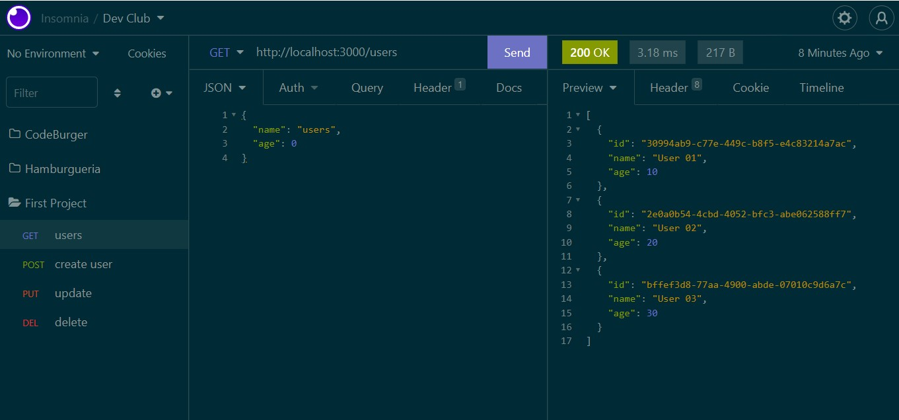

<h2>🚀 Nome do Projeto:</h2>

<h3>Primeiro Projeto Node - Users - Back-End - DevClub.</h3>
<h3>First Project Node - Users - Back-End - DevClub.</h3>

 

<h2>📝 Descrição do Projeto:</h2>

<h3>Projeto Back-end de cadastro de usuários (users) utilizando Javascript, NodeJS, Express e o Insomnia. Iniciando os estudos de Back-end com o NodeJs</h3>

<h3>Com esse simples projeto, através das rotas GET, POST, PUT e DELETE é possível criar, consultar, atualizar e deletar usuários através do Insomnia.</h3>

 

<h2>🖥️ O que foi utilizado:</h2>

 
 
 

<h2>🧰 Ajustes e melhorias:</h2>

<h4>Back-end do projeto foi finalizado. As próximas atualizações serão voltadas para seguintes tarefas:</h4>

- [x] Criação do Javascript.
- [x] Criação do Back-end utilizando Node.
- [ ] Criação do front-end utilizando React.
- [ ] Atualização da Interface.

 

<h2>💻 Pré-requisitos:</h2>

<h4>Apenas ter um computador ligado à Internet e uma conta no GitHub para visualizar.</h4>

 

<h2>🤝 Colaboradores</h2>

<h4>Agradeço às seguintes pessoas que contribuíram para este projeto:</h4>

<table>
  <tr>
    <td align="center">
      <a href="https://github.com/olivercaputo">
         
        
          <b>Oliver Caputo</b>
        
      </a>
    </td>
    <td align="center">
      <a href="https://www.github.com/rodolfomori" target="_blank">
         
        
          <b>Rodolfo Mori</b>
        
      </a>
    </td>
  </tr>
</table>
